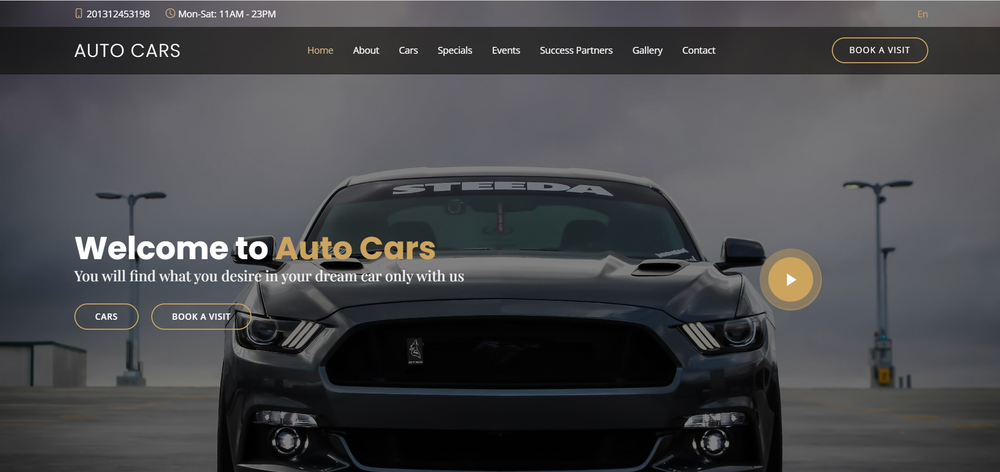

# Auto Cars - Luxury Showroom Website 

Welcome to the **Auto Cars** repository. This is a premium, responsive landing page designed for a high-end automotive showroom located in New Cairo. The site showcases a vast collection of luxury vehicles, promotes automotive events, and facilitates customer appointments.

##  About The Project

**Auto Cars** has been serving the New Cairo community since 2003, offering top-notch vehicles and exceptional customer service. This digital storefront is designed to provide car enthusiasts with an immersive experience, featuring:

* **Dynamic Car Catalog:** A filtered display of SUVs, Sport, and Desert vehicles.
* **Exclusive Specials:** Detailed showcases of hypercars like the *Ferrari LaFerrari* and *Bugatti Veyron*.
* **Event Promotion:** Information on "Coffee & Cars" and racing events.
* **Digital Booking:** A seamless form for scheduling showroom visits.

##  Key Features

* **Interactive Car Menu:** Browse a diverse inventory including brands like **Mercedes-Benz**, **Jeep**, **Tesla**, and **BMW**, with pricing and key features displayed on hover.
* **"Specials" Tabbed Interface:** A dedicated section allowing users to toggle between detailed specs and descriptions of rare vehicles (e.g., *Lamborghini Huracan Avio*, *Jeep Wrangler 2020*) without reloading the page.
* **Events Slider:** A responsive `Swiper.js` carousel highlighting upcoming activities like "Sports Car Racing" and "Classic Car Events".
* **Appointment Booking System:** A built-in frontend form allowing customers to reserve a visit by specifying date, time, and party size.
* **Multimedia Integration:**
    * **Video Lightbox:** Integrated YouTube popup for showroom introductions.
    * **Scroll Animations:** Elements fade and zoom in using `AOS` (Animate On Scroll) library.
    * ** Hidden Easter Egg:** Press the **'O'** key on your keyboard to toggle a **Lamborghini startup sound effect**!

##  Technologies Used

* **Core:** HTML5, CSS3, JavaScript (ES6)
* **Frameworks:** [Bootstrap 5](https://getbootstrap.com/) (Grid & Layout)
* **Libraries:**
    * **Swiper.js:** For touch-friendly car and testimonial sliders.
    * **AOS:** For scroll-triggered animations.
    * **GLightbox:** For responsive video and image lightboxes.
    * **Boxicons / Bootstrap Icons:** For UI iconography.

##  Getting Started

To run this project locally:

1. **Clone the repository:**

```bash
git clone https://github.com/AbdelrahmanGamal236/AutoCars-Showroom-Website.git
```

2. **Navigate to the folder:**

```bash
cd AutoCars-Showroom-Website
```

3. **Launch:**

Simply open the `index.html` file in any modern web browser.


## Contributing

Contributions are welcome! If you'd like to contribute to NeuroHeal, please follow these steps:

1. Fork the repository and create your branch from `main`.
2. Make your changes and ensure the code follows the project's coding standards.
3. Test your changes thoroughly.
4. Submit a pull request detailing your changes and their purpose.

## Contact

For inquiries about NeuroHeal and its models, please contact:
* **Email**: [Abdelrahman.Gamal.Ai@gmail.com](mailto:Abdelrahman.Gamal.Ai@gmail.com)
* **LinkedIn**: [linkedin.com/in/abdelrahman-gamal236](https://www.linkedin.com/in/abdelrahman-gamal236/)
* **WhatsApp**: +201029744194
* **GitHub**: [@AbdelrahmanGamal236](https://github.com/AbdelrahmanGamal236)
